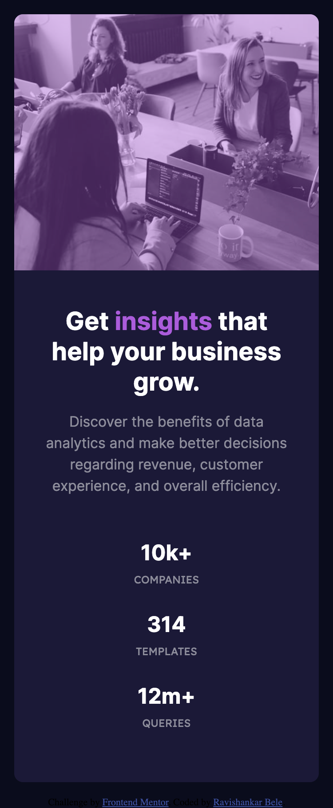

# Frontend Mentor - Stats preview card component solution

This is a solution to the [Stats preview card component challenge on Frontend Mentor](https://www.frontendmentor.io/challenges/stats-preview-card-component-8JqbgoU62). Frontend Mentor challenges help you improve your coding skills by building realistic projects. 

## Table of contents

- [Overview](#overview)
  - [The challenge](#the-challenge)
  - [Screenshot](#screenshot)
  - [Links](#links)
- [My process](#my-process)
  - [Built with](#built-with)
  - [What I learned](#what-i-learned)
- [Author](#author)
- [Acknowledgments](#acknowledgments)


## Overview

### The challenge

Users should be able to:

- View the optimal layout depending on their device's screen size

### Screenshot




### Links

- Solution URL: [GitHub](https://github.com/RaviBele/FrontEnd-Stats-Preview-Card)
- Live Site URL: [Add live site URL here](https://your-live-site-url.com)

## My process

### Built with

- Semantic HTML5 markup
- CSS custom properties
- Flexbox
- CSS Grid


### What I learned

Learned about CSS grid layout and how can we change layout of grid in responsive way.

Below code I used to create grid for content and image and also for records count:

```css
.container {
    max-width: 1110px;
    border-radius: 10px;
    overflow: hidden;
    display: grid;
    grid-template-columns: 1fr 1fr;
    margin: 1rem;
}

.records {
    display: grid;
    grid-template-columns: repeat(3, 1fr);
}

@media (max-width: 700px) {
    .container {
        max-width: 400px;
        grid-template-columns: 1fr;
        grid-template-rows: 1fr 2fr;
    }

    .content {
        padding: 2.5rem 2rem 0 2rem;
        grid-row-start: 2;
        text-align: center;
    }

    .records {
        display: grid;
        grid-template-columns: 1fr;
    }
}
```

## Author

- Frontend Mentor - [@RaviBele](https://www.frontendmentor.io/profile/RaviBele)


## Acknowledgments

This is where you can give a hat tip to anyone who helped you out on this project. Perhaps you worked in a team or got some inspiration from someone else's solution. This is the perfect place to give them some credit.

